# UML Diagrams — Ground Control Station (GCS)

> **Module**: CMP9134 Software Engineering — University of Lincoln  
> **Project**: Robot Management System — Ground Control Station  
> **Diagram Tool**: Mermaid.js (renders natively on GitHub)  
> **Last Updated**: May 2026

---

## Table of Contents

1. [Use Case Diagram](#1-use-case-diagram)
2. [Activity Diagram — Move Robot Command](#2-activity-diagram--move-robot-command)
3. [Class Diagram — Backend OOP Structure](#3-class-diagram--backend-oop-structure)
4. [Sequence Diagrams](#4-sequence-diagrams)
   - 4.1 [User Registration](#41-sequence-diagram--user-registration)
   - 4.2 [User Login with JWT](#42-sequence-diagram--user-login-with-jwt)
   - 4.3 [Move Robot — Success Path](#43-sequence-diagram--move-robot-success)
   - 4.4 [Move Robot — All Alternative Paths](#44-sequence-diagram--move-robot-all-scenarios)
   - 4.5 [View Robot Status (Telemetry Polling)](#45-sequence-diagram--view-robot-status)
   - 4.6 [View Map and Obstacles](#46-sequence-diagram--view-map-and-obstacles)
   - 4.7 [View Sensor Data](#47-sequence-diagram--view-sensor-data)
   - 4.8 [View Mission Logs](#48-sequence-diagram--view-mission-logs)
5. [Component Diagram — Docker Architecture](#5-component-diagram--docker-architecture)
6. [Entity Relationship Diagram (ERD)](#6-entity-relationship-diagram)
7. [Feature-to-Diagram Traceability](#7-feature-to-diagram-traceability)

---

## 1. Use Case Diagram

**Purpose**: Define the external perspective — who uses the Ground Control Station and what actions are available to each role. This diagram maps the Role-Based Access Control (RBAC) permissions to system features.

**Actors**:
- **Commander**: Full access — can view all telemetry data AND issue move/reset commands to the robot.
- **Viewer**: Read-only access — can view status, map, sensors, and logs but CANNOT control the robot.
- **Auditor**: Limited access — can view mission logs for compliance investigation.
- **Robot API**: External system actor — the virtual robot simulation container that the GCS communicates with.

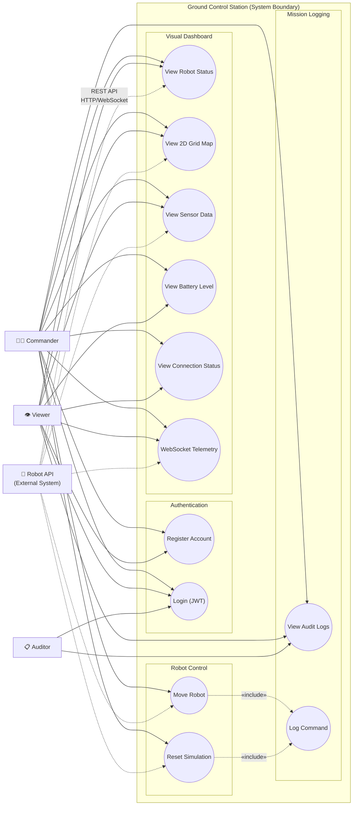

**RBAC Permission Matrix**:

| Actor | Register | Login | Status | Map | Sensors | Move | Reset | Logs | WebSocket |
|---|---|---|---|---|---|---|---|---|---|
| Commander | ✅ | ✅ | ✅ | ✅ | ✅ | ✅ | ✅ | ✅ | ✅ |
| Viewer | ✅ | ✅ | ✅ | ✅ | ✅ | ❌ (403) | ❌ (403) | ✅ | ✅ |
| Auditor | ❌ | ✅ | ❌ | ❌ | ❌ | ❌ | ❌ | ✅ | ❌ |

**Code Enforcement**: The `require_commander()` FastAPI dependency checks the `role` claim in the JWT token. If `role != "Commander"`, the endpoint returns HTTP 403 Forbidden before any robot communication occurs.

---

## 2. Activity Diagram — Move Robot Command

**Purpose**: Model the complete decision flow when a Commander clicks the 'Move' button. Every diamond node represents an `if/else` block that MUST exist in the code. This diagram covers input validation, authentication, RBAC, battery checks, robot communication, retry logic, and result processing.

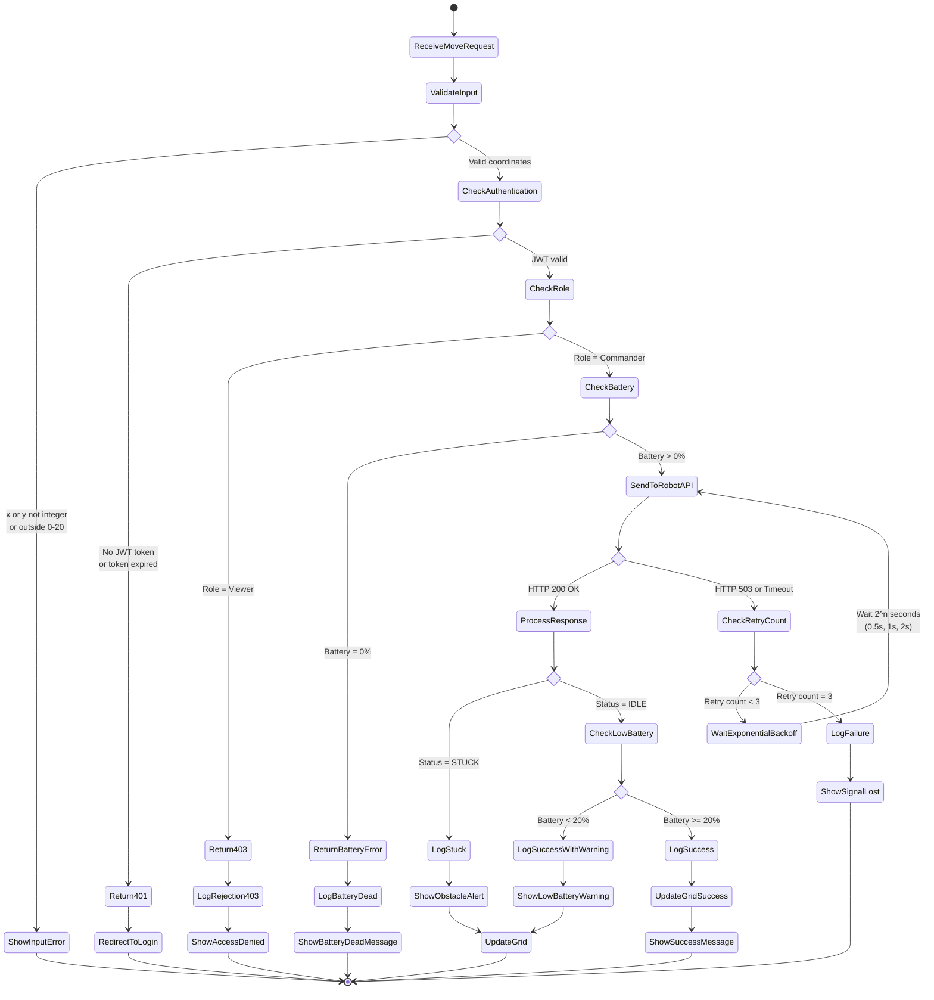

**Decision Node Mapping to Code**:

| Decision Node | Yes Path | No Path | Code Location |
|---|---|---|---|
| Valid input? (integer, 0–20) | Continue to auth check | Show input error, return 422 | Frontend JS validation + Pydantic model auto-validation in FastAPI |
| Authenticated? (JWT valid) | Continue to role check | Return 401 Unauthorized, redirect to login | `get_current_user()` dependency in `main.py` |
| Role = Commander? | Continue to battery check | Return 403 Forbidden, log rejection | `require_commander()` dependency in `main.py` |
| Battery > 0%? | Send request to Robot API | Return error "Battery dead, return to (0,0)" | Status check before move in `main.py` move endpoint |
| Robot API responds? | Process the response | Enter retry loop | `_request_with_retry()` in `robot_client.py` |
| Retry count < 3? | Wait 2^n seconds, retry | Log failure, show Signal Lost | Retry counter inside `_request_with_retry()` loop |
| Status = STUCK? | Log "stuck" event, show obstacle alert on grid | Check for low battery warning | Check `response.status` field in move endpoint |
| Battery < 20% after move? | Show LOW_BATTERY warning alongside success | Show clean success message | Frontend JS checks battery in telemetry poll |

---

## 3. Class Diagram — Backend OOP Structure

**Purpose**: Show the complete Object-Oriented Programming structure of the backend. Each class maps directly to a Python class, Pydantic model, or SQLAlchemy model in the codebase. The diagram highlights the three design patterns: Singleton, Facade, and Observer.

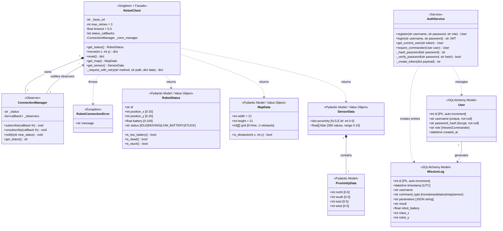

**Design Pattern Details**:

| Pattern | Applied To | How It Works | Why It Matters for Safety |
|---|---|---|---|
| **Singleton** | `robot = RobotClient()` at module level in `robot_client.py` | Python's module import system ensures only one instance exists. All route handlers in `main.py` share this single instance. | One controlled connection point prevents conflicting state. A single retry configuration and connection manager ensures predictable behaviour across all endpoints. |
| **Facade** | `RobotClient` class — methods `get_status()`, `move(x,y)`, `reset()`, `get_map()`, `get_sensor()` | Each method provides a clean, high-level interface. Internally, `_request_with_retry()` handles: httpx AsyncClient creation, URL construction, JSON serialisation, status code parsing, timeout management, and retry logic. | Callers (route handlers) never see HTTP complexity. This reduces the chance of developer error when calling the robot API — impossible to forget timeout configuration or retry logic. |
| **Observer** | `ConnectionManager` with `_observers` list | When `_request_with_retry()` detects a state change (connected → reconnecting → disconnected), it calls `_conn_manager.notify(new_state)`. All subscribed UI components update simultaneously. | Decouples connection monitoring from UI rendering. When the robot API drops, the battery bar, grid map, status indicator, and connection dot ALL update at the same time — no widget shows stale data while another shows 'Signal Lost'. |

---

## 4. Sequence Diagrams

### 4.1 Sequence Diagram — User Registration

**Purpose**: Trace the complete flow when a new user creates an account, from form submission through bcrypt hashing to database storage.

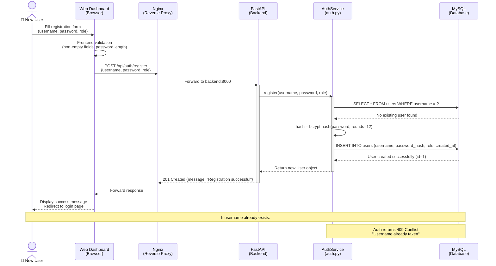

### 4.2 Sequence Diagram — User Login with JWT

**Purpose**: Trace the authentication flow from credential submission through bcrypt verification to JWT token issuance and storage.

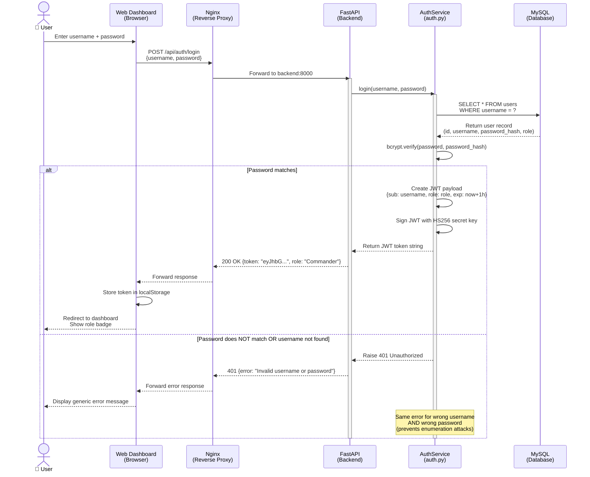

### 4.3 Sequence Diagram — Move Robot (Success)

**Purpose**: Trace the complete happy path of a Commander sending a move command through all system layers, from browser input to grid update.

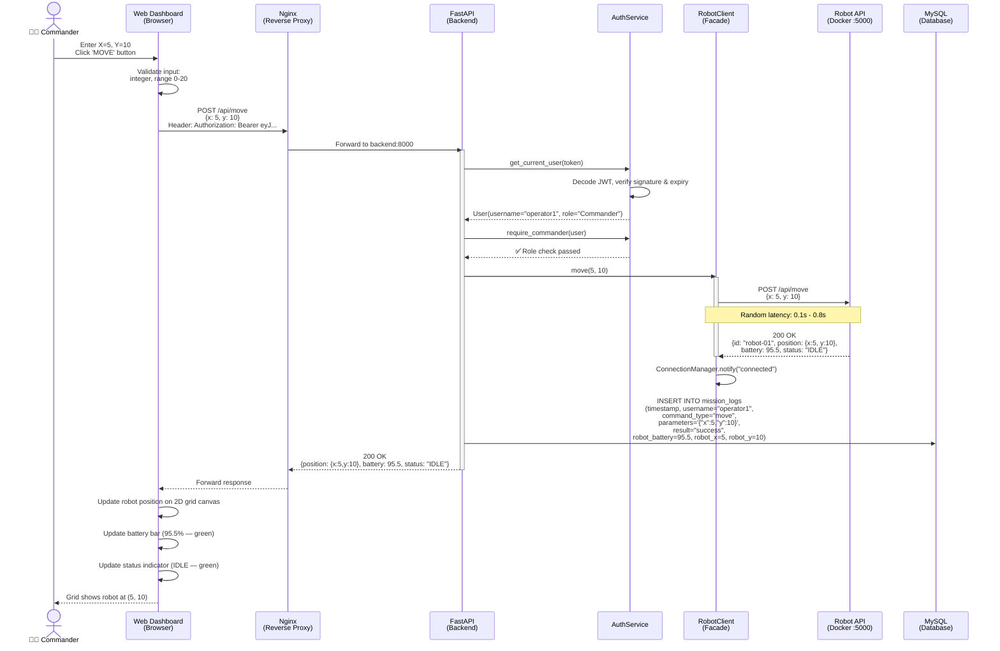

### 4.4 Sequence Diagram — Move Robot (All Scenarios)

**Purpose**: Show all five alternative paths that can occur during a move command. This is the most complex sequence diagram, covering success, STUCK, dead battery, 503 retry, and Viewer rejection.

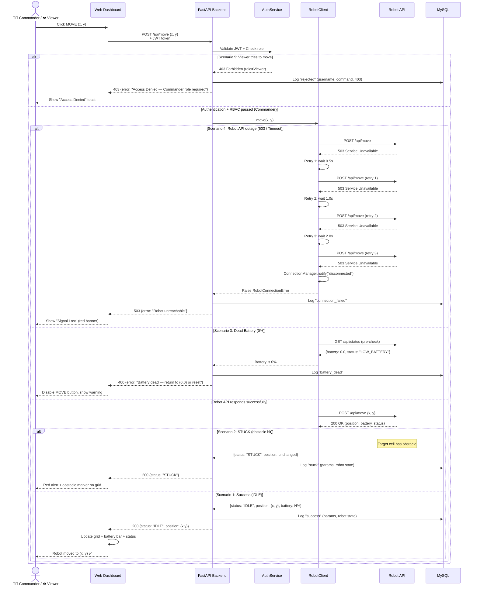

### 4.5 Sequence Diagram — View Robot Status

**Purpose**: Trace the telemetry polling cycle that runs every 3 seconds to keep the dashboard updated with the robot's current state.

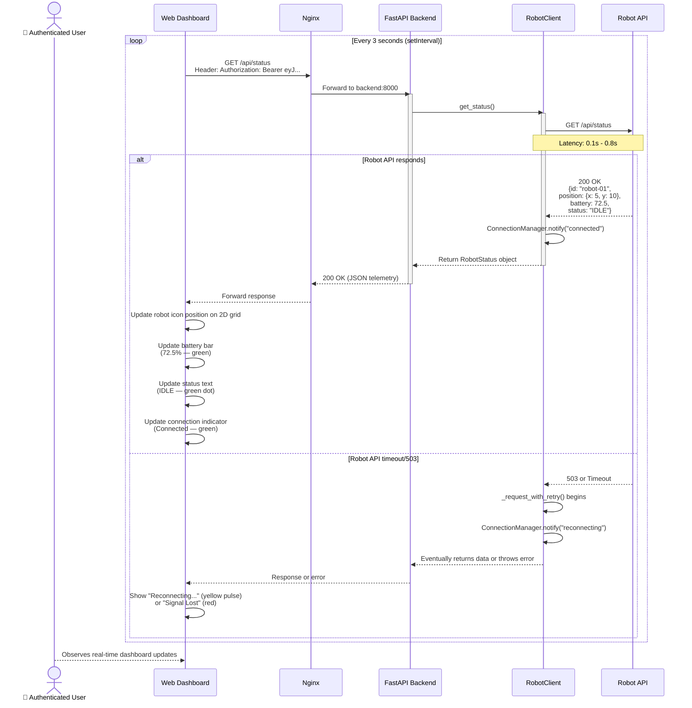

### 4.6 Sequence Diagram — View Map and Obstacles

**Purpose**: Trace how the 2D grid map is loaded and rendered, showing the 21×21 grid with 40 obstacles.

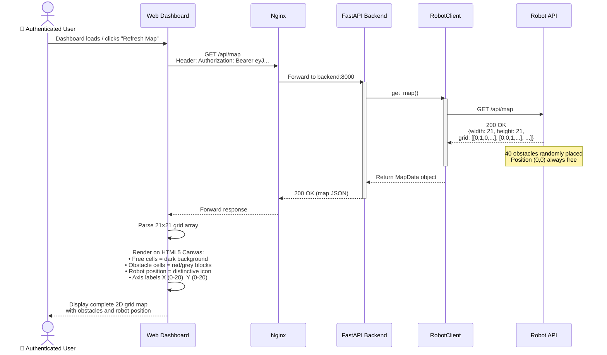

### 4.7 Sequence Diagram — View Sensor Data

**Purpose**: Trace how the robot's proximity sensors and lidar readings are retrieved and displayed.

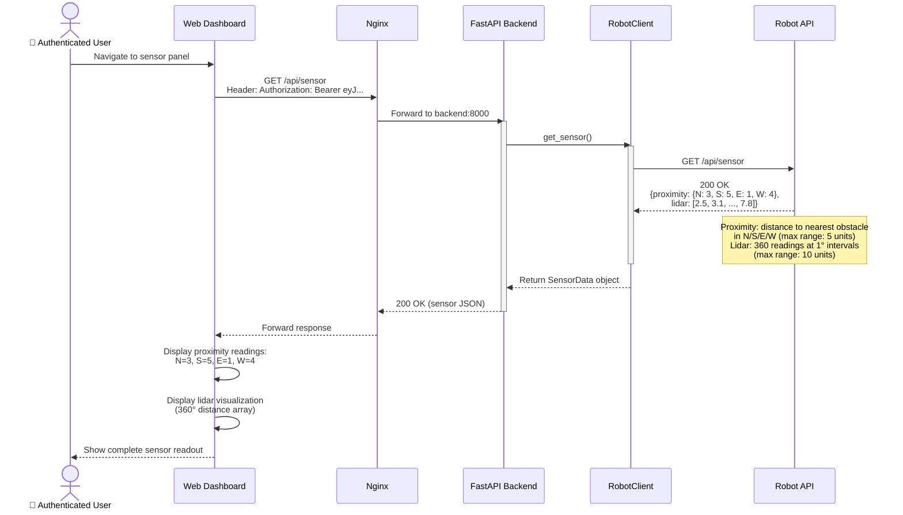

### 4.8 Sequence Diagram — View Mission Logs

**Purpose**: Trace how the audit trail is retrieved and displayed, showing the complete history of all commands sent to the robot.

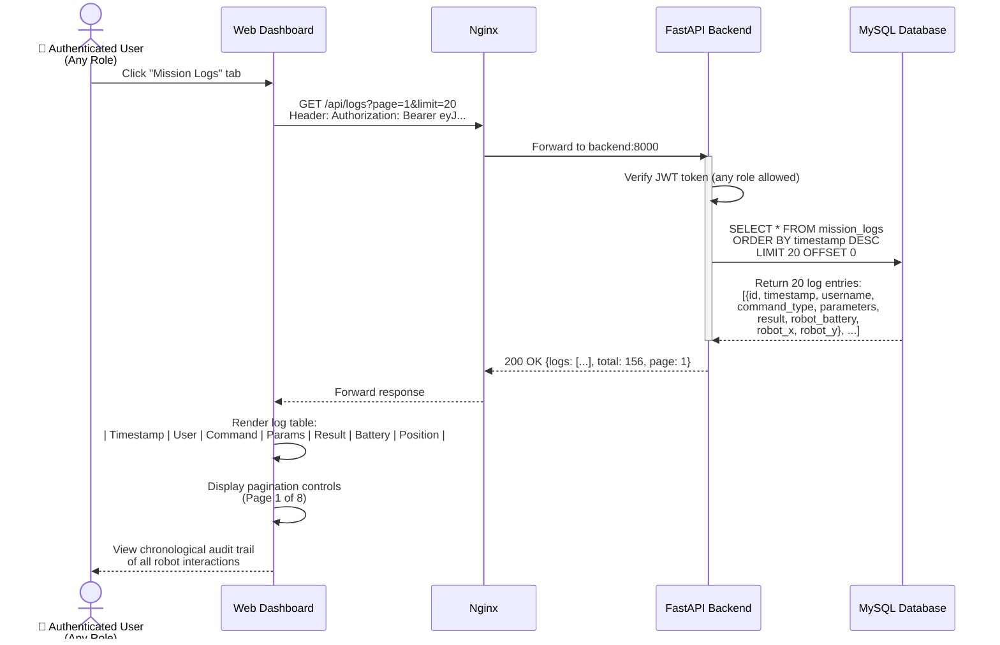

---

## 5. Component Diagram — Docker Architecture

**Purpose**: Show the physical deployment architecture — which Docker containers exist, what files they contain, how they communicate over the network, and which ports they use.

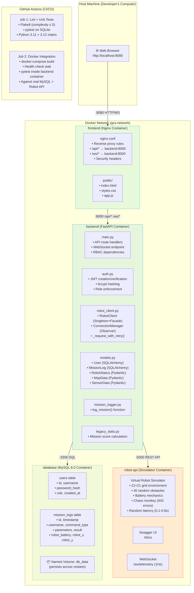

**Network Flow**: Browser → Nginx (:8080) → Backend (:8000) → Robot API (:5000, internal only). The browser NEVER communicates directly with the Robot API or Backend — all traffic is routed through Nginx. This eliminates CORS issues and adds a security layer by keeping internal services unexposed to the host.

**Container Details**:

| Container | Base Image | Exposed Port | Internal Port | Key Configuration |
|---|---|---|---|---|
| frontend | nginx:alpine | 8080 (host) | 80 | Reverse proxy: `/api/*` and `/ws/*` forwarded to backend:8000. Security headers: X-Frame-Options, X-Content-Type-Options. |
| backend | python:3.12-slim | — (internal only) | 8000 | Multi-stage Dockerfile: dev stage (hot-reload with uvicorn --reload) / production stage (non-root user 'gcs'). Reads `ROBOT_API_URL` and `DATABASE_URL` from environment. |
| robot-api | Pre-built simulation image | — (INTERNAL ONLY) | 5000 | NOT exposed to host — defence in depth. Only backend can reach it. Chaos monkey: latency 0.1–0.8s, 503 outages 5–10s. |
| database | mysql:8.0 | — (internal only) | 3306 | Stores `users` and `mission_logs` tables. Named volume `db_data` for persistence. |

---

## 6. Entity Relationship Diagram

**Purpose**: Show the database schema — the two tables that store all persistent data in the system.

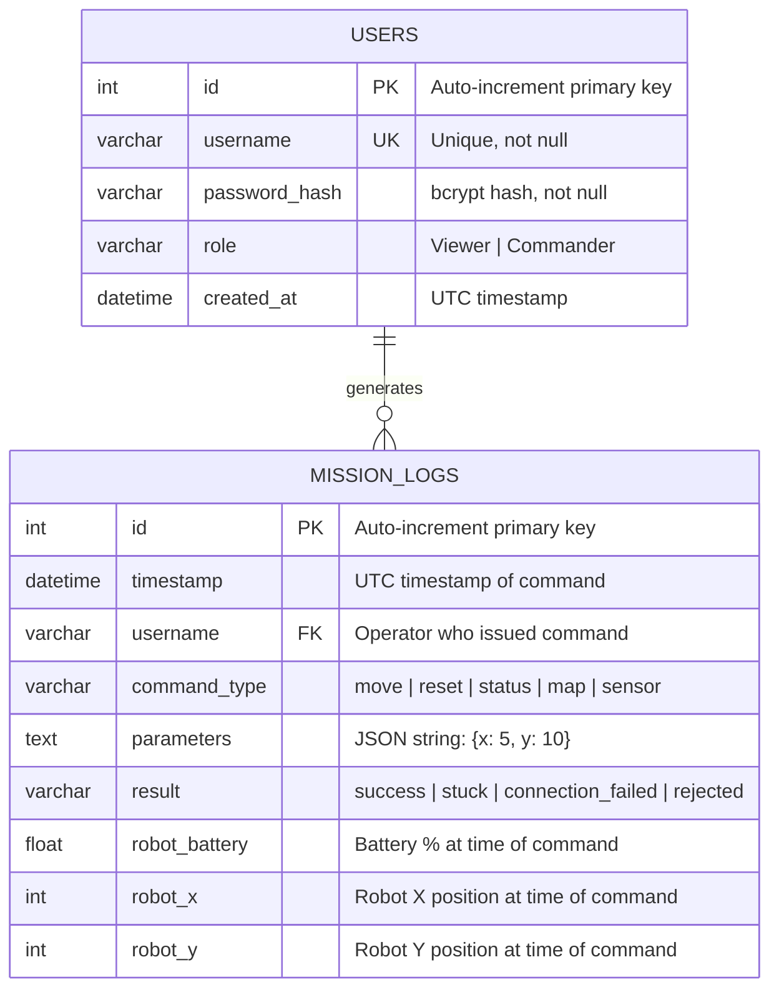

**Table Details**:

The `users` table stores authentication data. Passwords are never stored in plain text — only bcrypt hashes with 12 salt rounds. The `role` column enforces RBAC at the application level.

The `mission_logs` table provides a complete, immutable audit trail. Every interaction with the robot is recorded with the operator's identity, the exact command and parameters, the robot's response, and the robot's state (battery and position) at the moment the command was executed. This supports forensic investigation of any incident.

---
